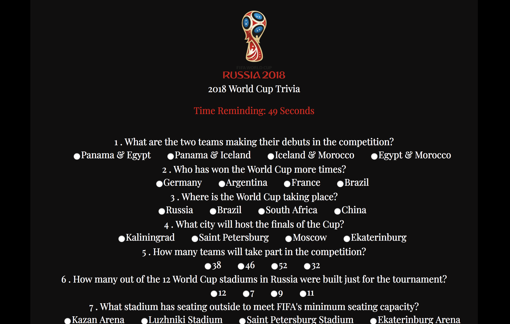

# TriviaGame

*_WorldCupTriviaGame_* !

*  Use the following link to get started [2018 World Cup Trivia Game](https://victoriagoesplaces.github.io/unit-4-game/)

## How to play?

Test you knowledge and speed by beating the clock (60 seconds) and answering questions about the 2018 World Cup!

### Score

The score will be based on how many of the quiz questions were responded and how many were correct or incorrect.

### Remember-

This is all about soccer and it is meant to be fun!

### Screenshot

